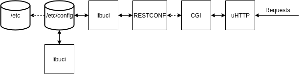

<!-- [![Contributors][contributors-shield]][contributors-url]
[![Forks][forks-shield]][forks-url]
[![Stargazers][stars-shield]][stars-url]
[![Issues][issues-shield]][issues-url]
[![MIT License][license-shield]][license-url]
[![LinkedIn][linkedin-shield]][linkedin-url] -->


<!-- PROJECT LOGO -->
<br />
<p align="center">
  <a href="https://github.com/digggy/orc">
    
  </a>

  <h3 align="center">OpenWrt RESTCONF</h3>

  <p align="center">
    This is a prototype implementation of RESTCONF for the OpenWrt system that utilizes the UCI configuration files as a datastore. The implementation also extends support to run  operations.
    <br />
    <a href="https://github.com/digggy/orc"><strong>Explore the docs »</strong></a>
    <br />
    <br />
    <a href="https://github.com/digggy/orc">View Demo</a>
    ·
    <a href="https://github.com/digggy/orc/issues">Report Bug</a>
    ·
    <a href="https://github.com/digggy/orc/issues">Request Feature</a>
  </p>
</p>


<!-- TABLE OF CONTENTS -->
<details open="open">
  <summary>Table of Contents</summary>
  <ol>
    <li>
      <a href="#about-the-project">About The Project</a>
    </li>
    <li>
      <a href="#getting-started">Getting Started</a>
      <ul>
        <li><a href="#prerequisites">Prerequisites</a></li>
        <li><a href="#building">Building</a></li>
      </ul>
    </li>
    <li><a href="#testing">Testing</a></li>
    <li><a href="#usage">Usage</a></li>
    <li><a href="#roadmap">Roadmap</a></li>
    <li><a href="#contributing">Contributing</a></li>
    <li><a href="#license">License</a></li>
    <li><a href="#contact">Contact</a></li>
  </ol>
</details>


<!-- ABOUT THE PROJECT -->
## About The Project

<!-- [![Product Name Screen Shot][product-screenshot]](https://example.com) -->

The efficient automation of operations in heterogeneous network devices from different
vendors is a great challenge. OpenWrt an open-source embedded operating system has
become a popular firmware choice replacing proprietary firmware on networking devices,
whether home routers or enterprise networks. 

RESTCONF is a network management
protocol that offers a programmatic interface for accessing state and configuration data,
RPC operations, and event notifications on a networking device. Although OpenWrt pro-
vides ways to run common network-related operations via the web user interface and
the command-line interface, it still lacks an efficient implementation of RESTCONF that
allows for efficient automated operation tasks across devices. Contemplating this pos-
sibility, OpenWrt RESTCONF (ORC) was extended to support operations.

<!-- GETTING STARTED -->
## Getting Started
The steps to setup the development environment can be quite hectic.
The following resources can help in development environment setup.

[OpenWrt/LEDE Quick Start](https://digggy.medium.com/openwrt-quick-start-493e08ed73f)

[UCI setup outside OpenWrt](https://openwrt.org/docs/techref/uci#usage_outside_of_openwrt)

## Architecture




### Prerequisites

1. Python 3 for the YANG conversion script
2. Tool for converting YANG to YIN

## Adding YANG modules

To add YANG modules for OpenWrt they have to go through some pre-processing. This is
what the `./yin2json/yin2json.py` script does.

### Annotations

Before YANG modules can be used with this implementation they have to be
annotated with the extensions provided in `/yang/openwrt-uci-extension.yang`.
An example of an annotated module is `/yang/restconf-example.yang`

### Script

1. Convert the YANG modules to be included to YIN and put them in one folder, i.e. `/yin`.
   For example with [`pyang`](https://github.com/mbj4668/pyang)
   ```console
   pyang -f yin ./yang/restconf-example.yang -p ./yang -o ./yin/restconf-example.yin 
   ```
2. Run the `yin2json.py` script
   ```console
   python3 ./yin2json/yin2json.py -y ./yin -o ./generated-for-openwrt ./yin/restconf-example.yin ...
   ```
   This converts the YIN files and generates a `.h` file in `./generated-for-openwrt` that has to be included in `/src/generated/yang.h`
   
   A script file ``yang2json.sh`` is also provided for automation of conversion directly from yang to the `yang.h` header file.

### Building

1. Clone this repository
2. `cd docker`
3. `docker build -t digggy/orc-sdk:1.0 .`
2. `cd ..`
4. `docker run -v $(pwd):/restconf digggy/openwrt-build`
5. The generated `.ipk` will be in the `build` folder
   
## Testing

The tests are inside the `/test` directory and are based on the Python
[Tavern Testing Framework](https://github.com/taverntesting/tavern). After
installing the framework the tests can be run using either of the
following commands:

```console
tavern-ci ./test/test_restconf.tavern.yml
# or
py.test ./test/test_restconf.tavern.yml
```

This will run integration tests that check the actual implementation. The
url where the server is located can be changed in `/test/common.yaml`.

<!-- USAGE EXAMPLES -->
## Usage

The .ipk file can be installed in the Openwrt system to utlize the features of 
restconf for the Openwrt devices.

_For more examples, please refer to the [Documentation](https://example.com)_


<!-- ROADMAP -->
## Roadmap

See the [open issues](https://github.com/digggy/orc/issues) for a list of proposed features (and known issues).


<!-- CONTRIBUTING -->
## Contributing

Contributions are what make the open source community such an amazing place to be learn, inspire, and create. Any contributions you make are **greatly appreciated**.

1. Fork the Project
2. Create your Feature Branch (`git checkout -b feature/AmazingFeature`)
3. Commit your Changes (`git commit -m 'Add some AmazingFeature'`)
4. Push to the Branch (`git push origin feature/AmazingFeature`)
5. Open a Pull Request


<!-- LICENSE -->
## License

Distributed under the BSD-3 License. See `LICENSE` for more information.


<!-- CONTACT -->
## Contact

Your Name - [@_dkunwar](https://twitter.com/_dkunwar) - d.kunwar@jacobs-university.de

Project Link: [https://github.com/digggy/orc](https://github.com/digggy/orc)

<!-- MARKDOWN LINKS & IMAGES -->
<!-- https://www.markdownguide.org/basic-syntax/#reference-style-links -->
[contributors-shield]: https://img.shields.io/github/contributors/othneildrew/Best-README-Template.svg?style=for-the-badge
[contributors-url]: https://github.com/digggy/orc/graphs/contributors
[forks-shield]: https://img.shields.io/github/forks/othneildrew/Best-README-Template.svg?style=for-the-badge
[forks-url]: https://github.com/digggy/orc/network/members
[stars-shield]: https://img.shields.io/github/stars/othneildrew/Best-README-Template.svg?style=for-the-badge
[stars-url]: https://github.com/digggy/orc/stargazers
[issues-shield]: https://img.shields.io/github/issues/othneildrew/Best-README-Template.svg?style=for-the-badge
[issues-url]: https://github.com/digggy/orc/issues
[license-shield]: https://img.shields.io/github/license/othneildrew/Best-README-Template.svg?style=for-the-badge
[license-url]: https://github.com/digggy/orc/blob/master/LICENSE.txt
[linkedin-shield]: https://img.shields.io/badge/-LinkedIn-black.svg?style=for-the-badge&logo=linkedin&colorB=555
[linkedin-url]: https://linkedin.com/in/othneildrew
[product-screenshot]: images/screenshot.png